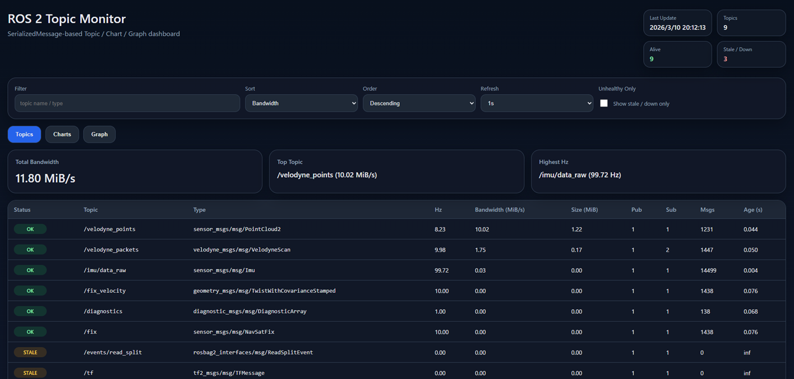
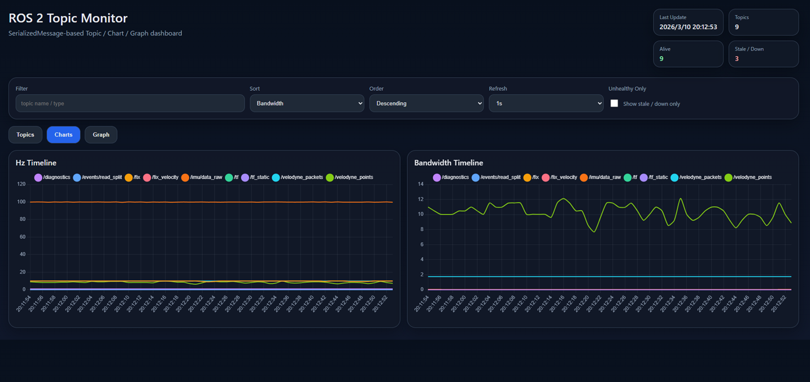
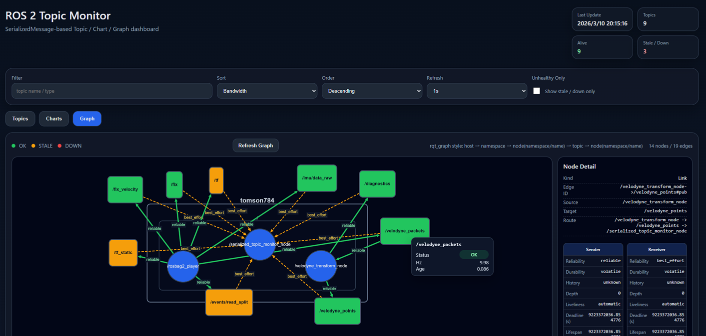

# serialized_topic_monitor

[](https://github.com/tomson784/ros2_comm_monitor/actions/workflows/ci.yml)
[](https://github.com/tomson784/ros2_comm_monitor/actions/workflows/ci.yml)

ROS 2 C++ monitor node that observes topic activity using `rclcpp::SerializedMessage`
without deserializing message payloads, then publishes JSON for web/dashboard consumers.

[日本語版 README](./README.ja.md)

## Overview

`serialized_topic_monitor` is designed for production-friendly runtime monitoring of ROS 2 topic traffic:

- Tracks per-topic publish rate (`Hz`)
- Estimates bandwidth (`bytes/s`, `MiB/s`)
- Detects stale topics using message age and timeout
- Publishes machine-readable JSON snapshots for UI/backend services
- Builds a graph view payload including nodes, topics, edges, and QoS metadata

This package is the backend monitor component used by the sibling package
`topic_monitor_web_server`.

The CI workflow runs a matrix build for both ROS 2 Humble and Jazzy on `main`.
Each badge points to the same matrix workflow, so a failure in either distro marks the workflow failed.

## Dashboard Screenshots

### Topic Monitor



### Chart Monitor



### Graph Monitor



## Features

- Generic subscription (`create_generic_subscription`) by topic type string
- No template specialization per message type required
- Supports large/high-throughput topics (e.g. image/point cloud) by observing serialized size
- Runtime filtering:
  - `allowlist`
  - `denylist`
  - hidden-topic filtering
  - ROS internal-topic filtering
- Runtime tunable scan/report intervals and stale threshold
- Sliding-window estimator for stable frequency/bandwidth values

## Node

- Executable: `serialized_topic_monitor_node`
- Node name: `serialized_topic_monitor_node`

## Published Topics

### 1) Stats JSON

- Topic name (default): `/topic_monitor/stats_json`
- Type: `std_msgs/msg/String`
- Payload: JSON object with topic list and computed metrics

Main fields:

- `generated_at_sec`
- `topic_count`
- `topics[]`:
  - `name`
  - `type`
  - `publisher_count`
  - `subscriber_count`
  - `alive`
  - `stale`
  - `hz`
  - `bandwidth_bytes_per_sec`
  - `bandwidth_mib_per_sec`
  - `latest_message_size_bytes`
  - `latest_message_size_mib`
  - `message_count`
  - `age_sec` (`null` if never received)

### 2) Graph JSON

- Topic name (default): `/topic_monitor/graph_json`
- Type: `std_msgs/msg/String`
- Payload: JSON graph for topology visualization

Main fields:

- `node_count`
- `edge_count`
- `nodes[]`:
  - `id`, `label`
  - `node_type` (`host | namespace | node | topic`)
  - `status` (`ok | stale | down | neutral`)
  - `host`
  - `node_namespace`
  - `parent_id`
- `edges[]`:
  - `id`, `source`, `target`
  - `qos` (short reliability label)
  - detailed QoS:
    - `qos_reliability`
    - `qos_durability`
    - `qos_history`
    - `qos_depth`
    - `qos_liveliness`
    - `qos_deadline_sec`
    - `qos_lifespan_sec`
    - `qos_liveliness_lease_duration_sec`
    - `qos_avoid_ros_namespace_conventions`

## Parameters

### Filtering

- `allowlist` (`string[]`, default: `[]`)
  - If non-empty, monitor only these topics.
- `denylist` (`string[]`, default: `["/parameter_events", "/rosout"]`)
  - Always excludes listed topics.
- `include_hidden_topics` (`bool`, default: `false`)
  - Include hidden topics (such as names ending with `/_*`) if `true`.
- `skip_internal_topics` (`bool`, default: `true`)
  - Excludes known internal/system topics.

### Timing / Estimation

- `scan_period_ms` (`int`, default: `1000`)
  - ROS graph scan period for creating/removing monitors.
- `report_period_ms` (`int`, default: `1000`)
  - Publish period for stats/graph JSON.
- `stale_timeout_sec` (`double`, default: `2.0`)
  - Topic is marked stale when no message is received longer than this threshold.
- `window_size` (`int`, default: `20`, minimum effective value: `2`)
  - Sliding window size used for `hz` and bandwidth estimation.

### Output Topics

- `stats_topic` (`string`, default: `/topic_monitor/stats_json`)
- `graph_topic` (`string`, default: `/topic_monitor/graph_json`)

## Build

From your ROS 2 workspace root:

```bash
colcon build --packages-select serialized_topic_monitor topic_monitor_web_server ros2_comm_monitor
source install/setup.bash
```

## Run

```bash
ros2 run serialized_topic_monitor serialized_topic_monitor_node
```

Run with custom parameters:

```bash
ros2 run serialized_topic_monitor serialized_topic_monitor_node --ros-args \
  -p allowlist:="['/points_raw','/camera/image_raw','/odom']" \
  -p denylist:="['/parameter_events','/rosout']" \
  -p include_hidden_topics:=false \
  -p skip_internal_topics:=true \
  -p report_period_ms:=1000 \
  -p scan_period_ms:=1000 \
  -p stale_timeout_sec:=2.0 \
  -p window_size:=20 \
  -p stats_topic:='/topic_monitor/stats_json' \
  -p graph_topic:='/topic_monitor/graph_json'
```

## Web Server

`topic_monitor_web_server` subscribes to the JSON topics from
`serialized_topic_monitor` and serves a browser UI plus simple HTTP APIs.

Start both nodes together:

```bash
ros2 launch ros2_comm_monitor bringup.launch.py
```

You can still start them separately if needed:

```bash
ros2 run serialized_topic_monitor serialized_topic_monitor_node
ros2 run topic_monitor_web_server topic_monitor_web_server
```

Open the UI in your browser:

```text
http://localhost:8080
```

Available parameters:

- `host` (`string`, default: `0.0.0.0`)
- `port` (`int`, default: `8080`)
- `stats_topic` (`string`, default: `/topic_monitor/stats_json`)
- `graph_topic` (`string`, default: `/topic_monitor/graph_json`)

Example with custom port and topic names:

```bash
ros2 launch ros2_comm_monitor bringup.launch.py \
  port:=8081 \
  stats_topic:=/topic_monitor/stats_json \
  graph_topic:=/topic_monitor/graph_json
```

HTTP endpoints:

- `/` or `/index.html`: browser UI
- `/api/stats`: latest stats JSON
- `/api/graph`: latest graph JSON

## Test

```bash
colcon test --packages-select serialized_topic_monitor topic_monitor_web_server
colcon test-result --verbose
```

## Design Notes

- Bandwidth is estimated from serialized message sizes observed at subscription callback time.
- The estimator computes:
  - `hz = (N - 1) / (t_last - t_first)`
  - `bandwidth_bytes_per_sec = sum(size[1..N-1]) / (t_last - t_first)`
- All JSON is generated manually with escaping to keep dependencies minimal.

## Limitations

- Host grouping in graph payload currently uses local hostname.
- QoS metadata is derived from discovered publisher/subscriber info; mismatches may exist in complex networks.
- This package focuses on monitoring transport-level behavior, not semantic message validity.
